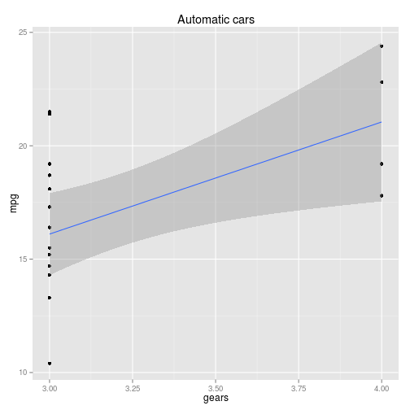
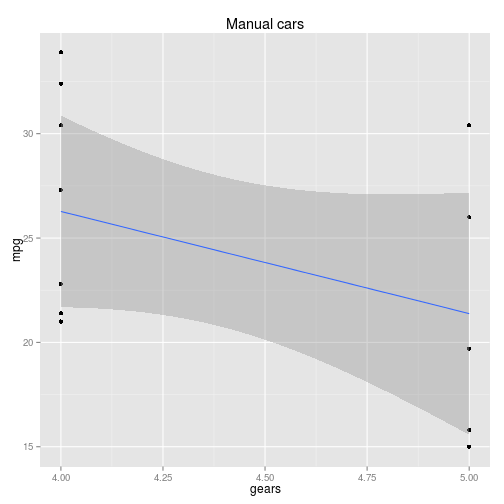

Mileage Variation Application
========================================================
author: Kapil Malik
date: 24 Aug, 2014
transition:rotate

Introduction
========================================================
incremental:true

<small>Mileage Variation Application uses the mtcars dataset to analyze mileage variation with a predictor variable and an additional filter based on the transmission type (manual, automated, both). The following predictors are available in application -
* Number of cylinders (_cyl_)
* Gross horsepower (_hp_)
* Weight in lb/1000 (_wt_)
* Number of forward gears (_gear_)
* Number of carburetors (_carb_)

**About mtcars dataset** : 
The data was extracted from the 1974 Motor Trend US magazine, and comprises fuel consumption and 10 aspects of automobile design and performance for 32 automobiles (1973–74 models).</small>


Understanding mtcars dataset
========================================================
<small>
The mtcars dataset has 32 entries with 11 columns. The mileage (mpg) variation summary is as follows -

```
   Min. 1st Qu.  Median    Mean 3rd Qu.    Max. 
   10.4    15.4    19.2    20.1    22.8    33.9 
```

<br/><p>
The application helps user to analyze how the mileage varies, as an effect of predictors like weight, horsepower, gears etc. User can select from 5 such predictors.</p>
Further, there are 19 cars with automatic transmission, and 13 with manual. The application also allows for seeing the effect on one of these sub-sets [see example](#/SampleAnalysis).
</small>

Sample Analysis
========================================================
id: SampleAnalysis
<small>
Mileage variation with number of gears, filtered by automatic transmission -
 

***
Mileage variation with number of gears, filtered by manual transmission -
 

</small>


Useful links
========================================================

You can find more about the application and dataset here -

* Git-hub link : [MileageVariationApp-Git](https://github.com/kapil-malik/MileageVariationApp)
* Shiny server link : [MileageVariationApp-Shiny](http://kmalik.shinyapps.io/MileageVariationApp/)
* mtcars dataset : [mtcars](http://stat.ethz.ch/R-manual/R-devel/library/datasets/html/mtcars.html)
